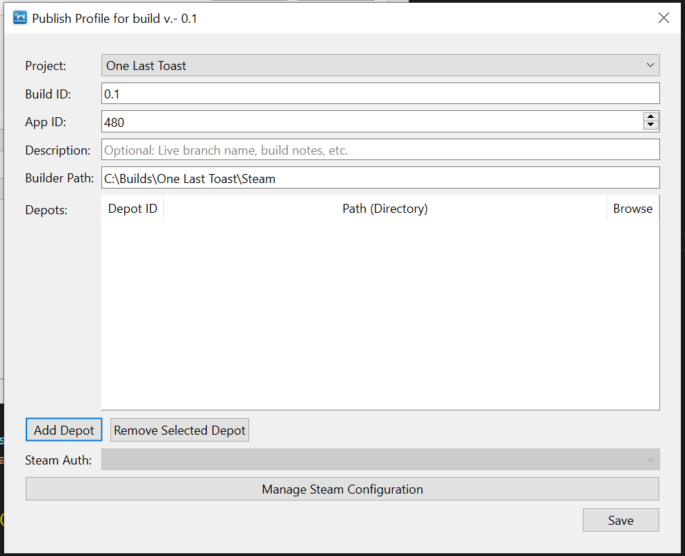
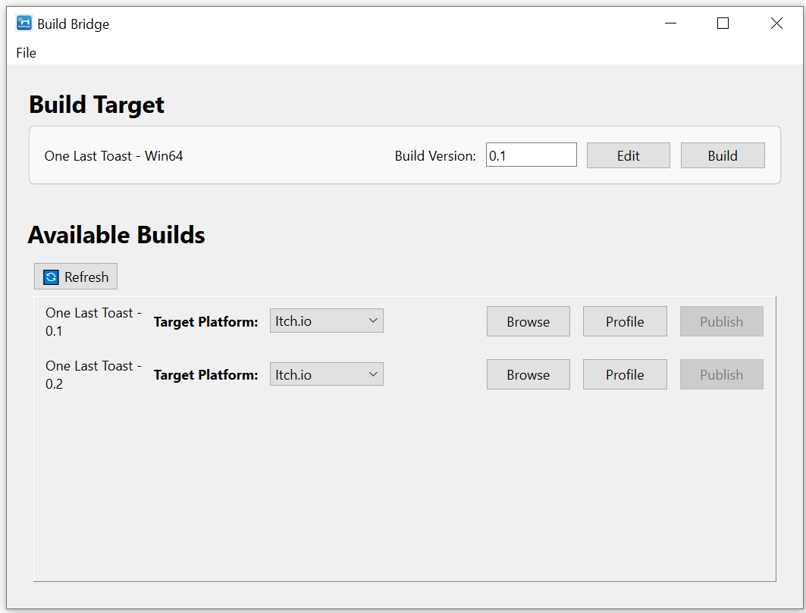
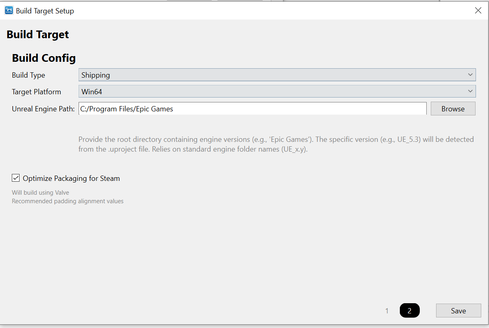
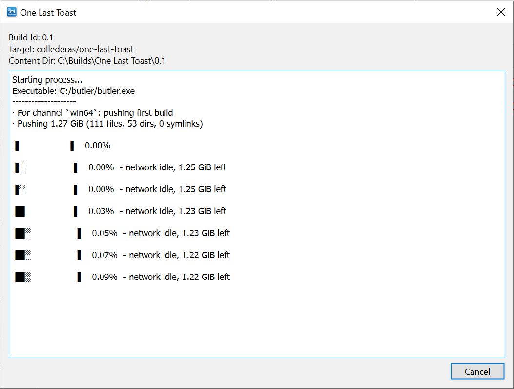

## A lightweight tool to Build and Publish my Game to Itch and Steam

I am currently playtesting my upcoming game -One Last Toast- and in this phase I need to iterate quickly: make a build, deploy, fix bugs, make another build.

Now, I am alone and have no fancy studio with proper CI/CD pipelines set up, so I was doing all of this manually.

Then one afternoon I decided that, while proper automation is probably overkill, having some sort of tool to make the process smoother would be nice.

## The App

With this tool I wanted to achieve 2 things:

- Have a structured system to keep all builds in one folder, organized by version number  
- Deploy to platforms using a few clicks

For this, I came up with the following UI:



Two sections. The top one solves problem 1, the bottom one solves problem 2.

## Building

You start by creating a **Build Target**, which is a configuration that saves your build preferences.




With that information, the Builder will use the `RunUAT` batch file in the Engine (yes, you need Unreal installed, but if you are using this tool then that’s a safe assumption for me) to build the project, and it will store it in the directory you configured in the Project settings.

You will be required to enter a version number in order to build, as you can see from the main interface. So builds will be located at:

```bash
ProjectName
	\_ BuildVersion (eg. v0.1)
		\_ Windows
	\_ BuildVersion (eg. v0.2)
```
## Publishing

The bottom part solves issue number 2: once I make a build I usually need to go get the right tool to publish the update. That would be:

- `butler`, for Itch  
- `SteamCMD`, for Steam  

Also, for Steam, I need to make sure that the `contentroot` value is correctly set in the `.vdf` file (not to mention you need to create a `.vdf` file the first time you publish).

So I automated all of that. The app stores your publishing preferences under a **Publish Profile**.



I configure this once and then they are saved for each subsequent build. So then publishing is just a matter of selecting the target store and pressing the “Publish” button.

This launches a wrapper around the related command-line tool in a separate process and shows logs in the dialog.



## Speed vs Quality

As I was developing, I initially gave in and let LLMs do most of the work. I had a design in mind, but the implementation was left to whatever AI chatbot I felt like using at the moment.

While on one hand this allowed me to have a working build quite soon — in less than a week — the time I then spent, and still have to spend, refactoring all the oddities that this caused is not negligible.

Still, I find it way less stressful to have a working product that does what it needs and that I can then refactor at my convenience, than putting a lot of effort and time into trying to come up with the perfect design upfront and delaying testing the product in the field by a lot.

Now, with this I am not advocating my style for everything. Every project has its own goals, and the approach varies based on those.

## I Released it!

In the end, I have in my hands a little tool that is an in-between solution — between a total lack of automation and a full CI/CD pipeline.

The tool forces some organization on the user, and allows publishing (albeit still manually) in a way that I find way friendlier than using a command line.

So I decided to make it public.  
The binary is hosted on itch.io and can be downloaded [here](https://collederas.itch.io/build-bridge).

The code is fully open source, under the Apache license, and hosted [on GitHub](https://github.com/Collederas/build-bridge).

I have just released a beta version that you can try out by downloading it from itch.  
The software is fully open source and you can check it out at [https://github.com/Collederas/build-bridge](https://github.com/Collederas/build-bridge).

I don’t know whether it currently packs enough features to appeal to a lot of developers out there, but if you are a fellow indie developer and happen to struggle with your release process — give it a try!

I will base future support on my personal needs, but I’d be very happy to tailor it to other people’s use cases.
