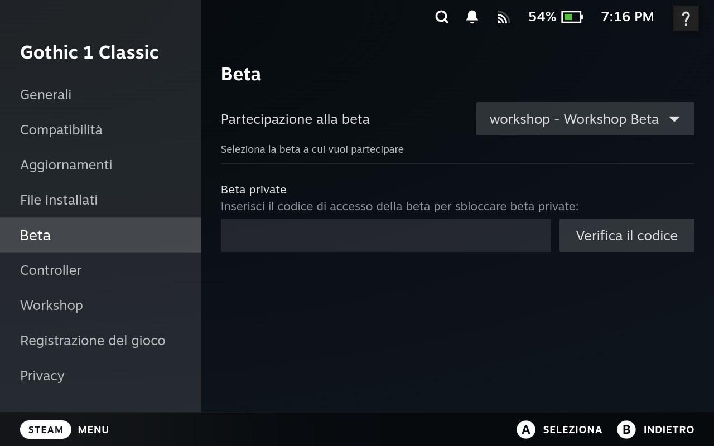
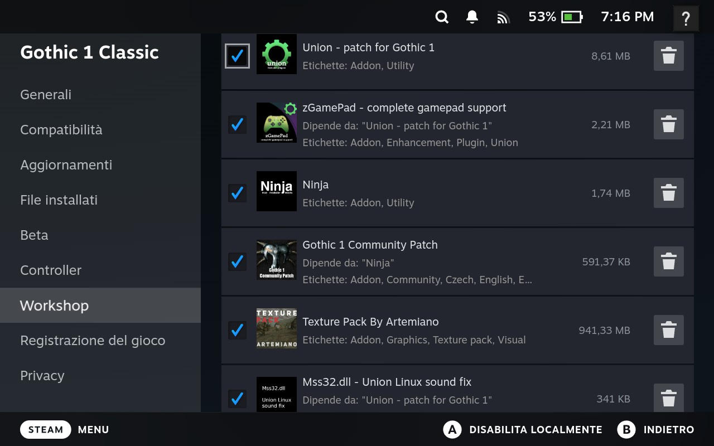
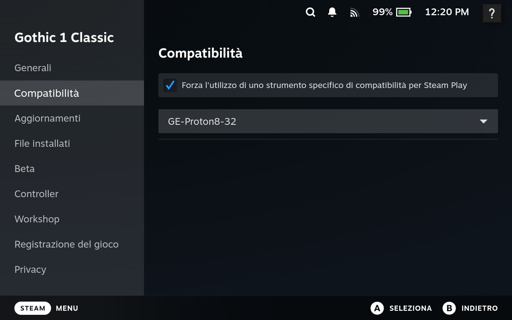
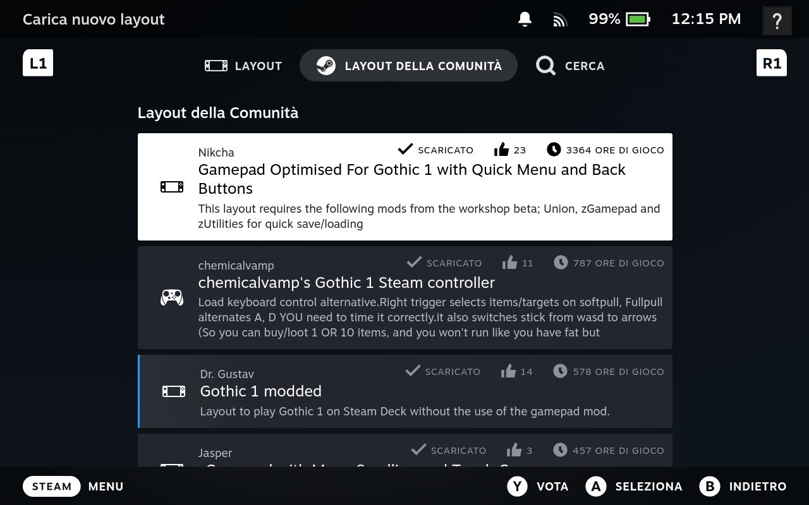

I recently had a kid and this meant my regular work schedule got completely flipped around. As this happened, in between nappy changing and feeding and caring for my girlfriend's recovery, I found little pockets of time, of about 2/3 hours, emerging from my new schedule.

That's when that Steam Deck, gifted by a dear friend and almost forgotten on a living room shelf, caught my eye.

But what game to play? For some obscure reason, a perverse idea creeped in my mind: I would really like to recover an old title that I never had the pleasure to play: Gothic1. I played the second and the third games, but never that original one.

Problem is, Gothic came out in 2001, way before Steam Deck was a thing, and -heck- way before console gaming was as mainstream as it is today. And Gothic was a PC only kind of deal. No controller. Just keyboard.

"Will I be able to make it work?", I thought. Turns out: yes. And better than I'd have hoped for. So I decided to share how.

## How to run Gothic 1 on a Steam Deck with full Gamepad Support

So, you want to enjoy this great classic while chilling on the couch. Great. This is entirely possible and I think you'll be pleased with the results; but, it will take a little bit of effort so get ready to get your hands dirty. Figuratively. We got to dig deep into the Deck's OS.


90% of **the** information available here comes from various places on The Internet. I just collected all relevant bits here and gave them some structure, so praise to the original authors. Notably [this reddit comment](https://www.reddit.com/r/SteamDeck/comments/uxtomx/comment/ia92wm7/) and [this steam workshop discussion](https://steamcommunity.com/workshop/filedetails/discussion/2791606767/592891465952152936/).


## Setup the Workshop

In Steam set Gothic beta version to "workshop". For this, navigate to the game settings (gear icon), Properties and scroll down to Beta and enable the workshop.



## Enable Mods
Visit Gothic 1 workshop and subscribe to the following mods:

- [Union - patch for Gothic 1](https://steamcommunity.com/sharedfiles/filedetails/?id=2787491081)
- [zGamePad - complete gamepad support](https://steamcommunity.com/sharedfiles/filedetails/?id=2793930041)
- [Ninja](https://steamcommunity.com/sharedfiles/filedetails/?id=2786936496)
- [Gothic 1 Community Patch](https://steamcommunity.com/sharedfiles/filedetails/?id=2789245548)
- [DirectX 11 Renderer](https://steamcommunity.com/sharedfiles/filedetails/?id=2791606767)
- [Mss32.dll - Union Linux sound fix](https://steamcommunity.com/sharedfiles/filedetails/?id=2813524957)


The order in which these mods are loaded matters. You can let steam detect the ideal order using the option in the dropdown or order them yourself. You can see below the intended order.



## Setup The Emulator

This is an old Windows game and will need emulation. Steam comes preloaded with some Proton versions but in order to load all the mods above we need a custom version called ProtoUp-Qt.

In order to install this you need to switch to the destkop mode. Press the STEAM button, go to "Power" and select "Switch to Desktop".

Now, from the Launcher select System->Terminal.

```bash
$ flatpak install net.davidotek.pupgui2
$ flatpak install com.github.Matoking.protontricks
```

Now run the ProtonUp-Qt desktop app and install the latest Proton-GE version 8. Version 9 is the latest at the moment of writing and it has some issues where the game crashes on launch for some reason. If a new version has been released by the time you are reading this, maybe it is worth trying it.

One last thing before exiting Desktop mode: Use Dolphin, the File Manager to navigate to "~/.steam/steam/steamapps/common/Gothic/system" and delete SteamPack.ini. We need this to allow the Union mod to generate its own replacement.

Switch back to gaming mode and enable the downloaded ProtonGE version from the list (it will likely be at the bottom).



Run the game. You should see the following screen:


If you got here, congratulations, but now you have to quit the game. We are not done yet, this step was just to allow the game to generate some required Proton directories.

## DirectX11 and Music Fixes

If you play the game now you will likely have no music and no DirectX11 support. Let's fix that.

Switch back to desktop mode and launch the terminal again:

```bash
$ flatpak run com.github.Matoking.protontricks 65540 directmusic
```

One more thing to allow this mod to work: open "~/.steam/steam/steamapps/compatdata/65540/pfx/user.reg" file in text editor:
In the section

```[Software\\Wine\\DllOverrides]```

add this line

```"ddraw"="native,builtin"```

this enables the DirectX 11 renderer
and delete

```"*dsound"="native"```

this fixes some minor sound delay and crackling
Save and close.

## Fix GD3D11 crash
It is possible that this is all you need and the game should now run. But, there is a chance that instead you will be greeted by a GD3D11 crash on your next launch. If that is the case, no fret, there is a fix!

Switch to Desktop mode and use Firefox to navigate to the [GD3D11 Github page](https://github.com/kirides/GD3D11).

Download the `17.8-dev9` version (you can switch Tags from the dropdown at the top, next to the Branches and Tags indicator).

Download and extract the contents somewhere. Copy/paste the files from github to the System folder. Note, that it will paste all the files from the GD3D11 folder in the System folder and not in the GD3D11 subfolder.

You can find the Gothic System folder under `Steam\steamapps\common` and the AppID of Gothic (which you can see in the Steam URL when you navigate to your Gothic copy in the Library).

Switch back to Game Mode and launch the game. Congratulations, you can now enjoy this old classic fully restored and with modern rendering features!

## Gamepad support
You will probably have to get used to the way Gothic handles interaction. It's quite old style (here an [explanatory video](https://www.youtube.com/watch?v=n_vIs-kavqI) about it).

But, there are ways to make this a bit more user-friendly by activating a community controller layout. You can -at any point- use the STEAM button while playing the game to reveal the game menu where you can access the Gamepad options.

You can navigate right to the Community Layouts. Experiment a bit and find the one the works best for you.



Enjoy!