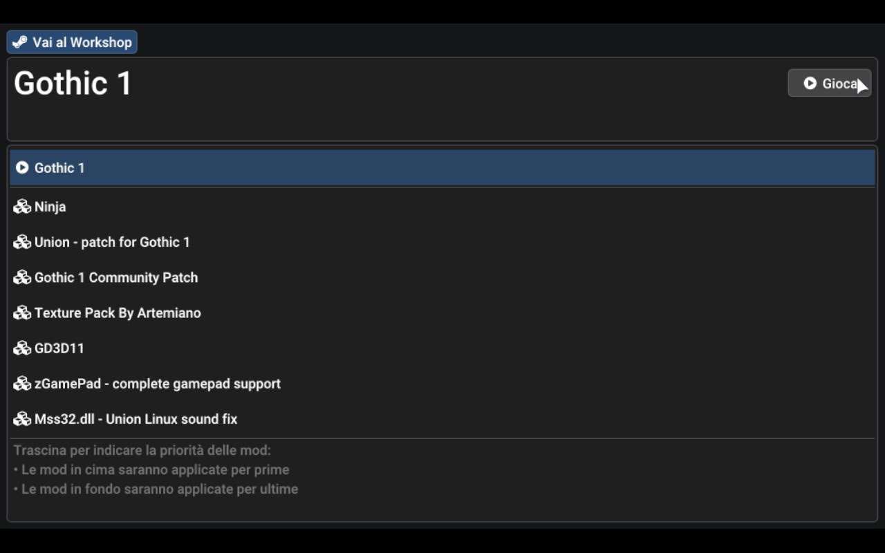
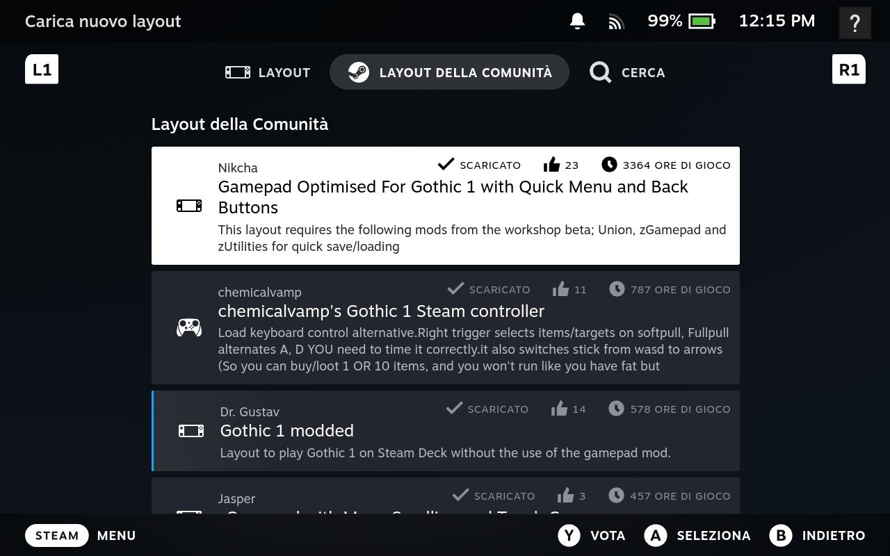

I recently had a kid, and this meant my regular work schedule got completely flipped around. As this happened, in between nappy changing, feeding, and caring for my girlfriend's recovery, I found little pockets of time—about 2–3 hours—emerging from my new schedule.

That's when the Steam Deck, gifted by a dear friend and almost forgotten on a living room shelf, caught my eye.

But what game to play? For some obscure reason, a perverse idea crept into my mind: I really wanted to revisit an old title that I never had the pleasure of playing—Gothic 1. I played the second and third games but never the original.

The problem is, Gothic came out in 2001—way before the Steam Deck was a thing and, heck, way before console gaming was as mainstream as it is today. And Gothic was a PC-only kind of deal. No controller. Just keyboard.

"Will I be able to make it work?" I thought. Turns out: yes. And better than I'd hoped for. So I decided to share how.

## How to run Gothic 1 on a Steam Deck with full Gamepad Support

So, you want to enjoy this great classic while chilling on the couch? Great. This is entirely possible, and I think you'll be pleased with the results. But it will take a little bit of effort, so get ready to get your hands dirty—figuratively. We’ve got to dig deep into the Deck's OS.


90% of **the** information available here comes from various places on The Internet. I just collected all relevant bits here and gave them some structure, so praise to the original authors. Notably [this reddit comment](https://www.reddit.com/r/SteamDeck/comments/uxtomx/comment/ia92wm7/) and [this steam workshop discussion](https://steamcommunity.com/workshop/filedetails/discussion/2791606767/592891465952152936/).


## Setup the Workshop

In Steam, set Gothic's beta version to "workshop." To do this, navigate to the game settings (gear icon), select Properties, scroll down to Beta, and enable the workshop.


## Enable Mods
Visit Gothic 1 workshop and subscribe to the following mods:

- [Union - patch for Gothic 1](https://steamcommunity.com/sharedfiles/filedetails/?id=2787491081)
- [zGamePad - complete gamepad support](https://steamcommunity.com/sharedfiles/filedetails/?id=2793930041)
- [Ninja](https://steamcommunity.com/sharedfiles/filedetails/?id=2786936496)
- [Gothic 1 Community Patch](https://steamcommunity.com/sharedfiles/filedetails/?id=2789245548)
- [DirectX 11 Renderer](https://steamcommunity.com/sharedfiles/filedetails/?id=2791606767)
- [Mss32.dll - Union Linux sound fix](https://steamcommunity.com/sharedfiles/filedetails/?id=2813524957)


The order in which these mods are loaded matters. You can let steam detect the ideal order using the option in the dropdown or order them yourself. You can see below the intended order.



## Setup The Emulator

Since this is an old Windows game, it requires emulation. Steam comes preloaded with some Proton versions, but to load all the mods above, we need a custom version called ProtonUp-Qt.

To install this:

1. Switch to Desktop Mode. Press the STEAM button, go to Power, and select Switch to Desktop.
2. Open the Terminal from the launcher (System → Terminal).
3. Run the following commands:

```bash
$ flatpak install net.davidotek.pupgui2
$ flatpak install com.github.Matoking.protontricks
```

4. Open the ProtonUp-Qt desktop app and install the latest Proton-GE version 8. (Version 9 is the latest at the time of writing, but it has issues where the game crashes on launch. If a newer version is available, it may be worth trying it.)
5. Before exiting Desktop Mode, open Dolphin (File Manager) and navigate to: 
    
    ```text
    ~/.steam/steam/steamapps/common/Gothic/system
    ```
    
    Here, delete _SteamPack.ini_ to allow the Union mod to generate its own replacement.
6. Switch back to Gaming Mode and enable the downloaded Proton-GE version from the list (likely at the bottom).


Launch the game. You should see the Gothic Mod Launcher screen.



If you got this far—congratulations! But now, quit the game. We are not done yet; this step was just to allow the game to generate some required Proton directories.

## DirectX11 and Music Fixes

If you play the game now, you’ll likely have no music and no DirectX 11 support. Let’s fix that.

Switch back to Desktop Mode and launch the Terminal again:

```bash
$ flatpak run com.github.Matoking.protontricks 65540 directmusic
```

One more thing to allow this mod to work: 
1. Open the file
    ```text 
    ~/.steam/steam/steamapps/compatdata/65540/pfx/user.reg
    ```
2. Find the section
    ```text
    [Software\\Wine\\DllOverrides]
    ```
3. Add this line

    ```text
    "ddraw"="native,builtin"
    ```
_(This enables the DirectX 11 renderer.)_

4. Delete

    ```text
    "*dsound"="native"
    ```
_(This fixes some minor sound delay and crackling)_

5. Save and close

## Fix GD3D11 crash
At this point, the game should run fine. However, if you encounter a GD3D11 crash on launch, there’s a fix.

1. Switch to Desktop Mode and open Firefox.
2. Go to the GD3D11 GitHub page.
3. Download the 17.8-dev9 version. (You can switch tags from the dropdown at the top, next to the "Branches and Tags" indicator.)
4. Extract the contents and copy/paste the files from GitHub into the System folder. (Do not put them inside a GD3D11 subfolder —paste them directly in System). You can find the Gothic System folder under: 

    ```text
    Steam\steamapps\common\Gothic\system
    ```

    The AppID for Gothic is visible in the Steam URL when you navigate to your copy in the Library.

5. Switch back to Game Mode and launch the game.


## Gamepad support

You’ll probably need to get used to Gothic’s old-school interaction system. [Here](https://www.youtube.com/watch?v=n_vIs-kavqI) is an explanatory video about it.
However, you can improve the experience by activating a community controller layout. Navigate to:

Controller Settings (next to Settings on the game page)→ Community Layouts.

Experiment with different layouts to find the one that works best for you.



## Enjoy!
That’s it! You can now play this old classic, fully restored and with modern rendering features, on your Steam Deck. Happy gaming! 