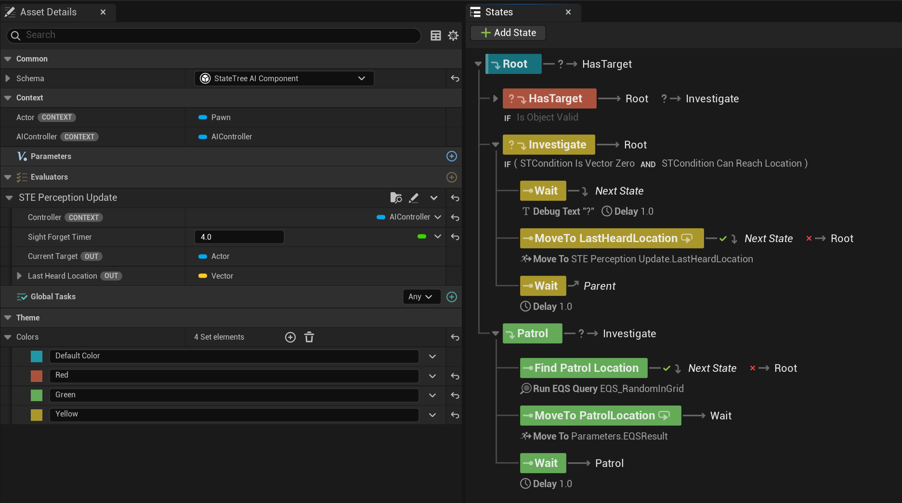
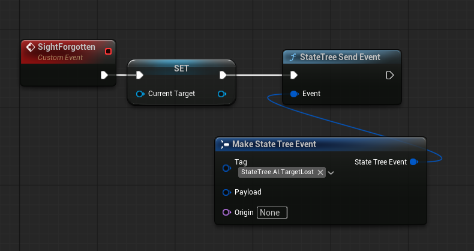

Building a working AI in Unreal should be easy, especially when all you want is something to patrol, investigate noises, and chase players. But if you’ve used Unreal's AI Perception system, you already know: it’s not as intuitive as it looks.

In this post, I’ll walk through how I got a simple, reliable state-based AI working using State Trees, and how to avoid the common traps with AI Perception that ate days of my time.

Individually, each of these states is easy enough to set up. The problem is switching between them at the right time in a way that is functional to the gameplay.

I believe partly it’s due to the **Unreal AI Perception system** being a bit cryptic and counterintuitive. And partly, because I didn’t fully understand the tools and was trying to create transitions the wrong way.

Eventually, I figured out a decent way to go about it. Let me share a few ideas here.

## What I Want to Build
As said, at its core, I want an agent that can switch between 3 states:

- **Default**: when the agent has no task. this can be used for example to patrol but also staying idle.
- **Investigate**: move to last heard location.
- **Chase**: follow player and/or attack.

The general idea is summed up in this graph:

It is basically composed of 2 parts: 
- the state machine handling the transitions 
- a task (which I called *UPDATE TASK* in the picture above), running alongside it, responsible to update all the variables that are required for the state machine transitions.

Let’s break it down.

## Transition Rules

Looking at the transitions we have:

Default     → Investigate  | Heard a sound  
Investigate → Chase        | Target acquired  
Chase       → Investigate  | Lost sight of target for X seconds  
Investigate → Default      | Target not reacquired  

All of them are based on **Perception** updates: either hearing or sight. So that is the main system we'll be dealing with. Unfortunately -and here comes the tricky part- we don't really get events from the Unreal Perception System as we would intuitively want them.

## AI Perception refresher

Since this system is likely one of the biggest hurdles for newcomers trying to build their simple AI, a little refresher is in order.

The system works by assigning an *AI Perception Component* to the agent's *AI Controller* and configuring which senses we want to be active.

The component offers a delegate that can be bound to receive informations every time a new target is perceived with one of the configured senses.

It offers a public, blueprint exposed, API with the following functions:

and the following delegates that can be bound to:

Now let's think of the logic we are trying to build. For the simple cases where we just need to know whether a target is in sight or a sound has been heard there's no major problems. But let's consider the CHASE->INVESTIGATE case. We want to be notified when the Agent has lost track of the target -when the sight sense has expired-. How would you go about that?

You might look at the senses config above and notice that it allows you to configure a `Max Age`: that is the amount of time a sense is kept into active memory before being discarded. Perfect! We can use this to forget the Sight sense after X seconds!

**Wrong.**

Or better, that is exactly what this setting does. But not as you might intuitively think. Let me elaborate.
There are -I believe- 2 ways you could think of going about it. And both have gotchas:

   1. Using the payload of the `OnPerceptionInfoUpdated` event
   2. Using the `OnTargetPerceptionForgotten` event 

### Why you will use OnPerceptionInfoUpdated wrong
This is the event with its payload:

You might look at it and think: since we get information on both the sense and the `Expiration Age`, we could check if this value is greater than or equal the `Max Age` (which you can configure in the `AIPerceptionComponent` - see pic above) et voilà! 

**Wrong. Again**

This is an *Update* event: it fires at the exact moment a stimulus changes. That means when the target just got into sight, or just exited sight. If the event just happened, it means it had no time to tick its expiration clock yet: **the Expiration Age in PerceptionUpdate events callbacks will always be 0**!

Ok, but we can maybe use the `OnTargetPerceptionForgotten` then!

### Why you will use OnTargetPerceptionForgotten wrong
First of all, to use this event you need to explicitly enable it in Project Settings.

Once you do this, you can bind to the related event. The problem is that this event is fired only when **all** stimuli for a given Actor are forgotten. That is: if the agent forgets sight, but still has a hearing stimuli for the same actor, the event won't fire because technically the Agent is still aware of the target.

This is a problem for us: CHASE->INVESTIGATE requires that we detect when the Sight sense has expired, but not the Hearing one. On the contrary: we would like to fallback to existing hearing information for the same Actor so that we can tell the AI Agent to go investigate the last hearing stimulus.

So, how do we get around all this? 

I propose a timer.

## Handling sight stimulus

We are going to create our own -sight-specific- aging system. It's actually very simple:

1. When sight is lost, we start a **timer**.
2. If the timer expires without reacquiring the target, we forget them.
3. If the target is seen again, we **reset the timer**.

How do we determine if sight is lost? Well, the info update comes with a *Is Successfully Sensed* boolean that we can use for this: if `True` the Agent just acquired line of sight (LOS), if `False` the LOS has just been lost.

The rest of the logic is very simple: register a new target when LOS is acquired -if the Agent didn't already have a valid target before- and reset the timer for the known target otherwise.
And since we need to keep track of the last heard location too, we will override the related variable every time a hearing update comes in.

Overall it will look like this:

## Implementation
With the quirks of the perception system behind us we can translate this into practice.
If you want to go with UE's default AI systems you have 2 choices: **Behavior Trees** and **State Trees**.

I find it easier to model this using State Trees because they are built around the concept of, well, state. They allow you to define authoritative transition logic: when this happens, go to this state. 
You can achieve the same exact thing with Behavior Trees (after all, you can use BTs as State Machines) but that is the path you take if you really want to complicate your life. Because Behavior Trees are reactive it is harder to define when and how a transition should take place.

So, with State Tree we can use a **State Tree Evaluator** to handle the logic that binds to the `AIPerceptionComponent` and updates the relevant variables. We need to keep track of:
- The current target
- The last heard location (for the purposes of this example we will only care about the last noise heard)

The Evaluator will:
- Register for **perception updates**
- Track the current **Target** and **LastHeardLocation**
- Send **custom events** to trigger state transitions (this is what will cause the tree to switch to a new state)
- Start and resets the **forget timer** for our custom Sight aging system


You could forego the event sending part and handle the logic inside the State Tree transitions if you wanted to.


This is the whole logic:

With sight updates here:

And hearing updates here:

Notice 2 things:

1. The timer is stopped the moment the same target (you must check that the stimulus belongs to the same target!):

2. The event to clear the target when the timer expires also updates the tree with an event. If you were to use transition logic, you'd have to monitor the `Current Target` variable on tick in the transition instead.

I am using another event here to inform the tree that the target is lost and a transition is required.

The whole tree looks like this:

The key here is in how to setup transitions. In particular we want to be sure that from any state we can go to Chase the moment the Agent catches sight of the target. That is why we put this transition on Root:

Then, in order: 

From Chase, we go to investigate if the *Evaluator* tells us that we lost track of the target for long enough; and we transition to Root otherwise (that is basically when the Agent -for any reason- cannot reach the target).

From Patrol we similarly move to root when Agent cannot find a valid patrol location, else we stay in that state (until a target is acquired that is):

Lastly, from investigate we always go to root, whether we can investigate the last heard location or not (always have a failsafe transition if Agent cannot perform certain actions).

And really, that's it.

As you see, the whole thing is not hard. It just requires you to know of some quirks with the involved systems.

Now, this setup won’t cover every edge case, but it gives you a robust foundation for prototyping and iterating on more complex behaviors. And once you understand how Unreal's Perception quirks work under the hood, you'll stop fighting the system and start using it.


Earlier I mentioned that part of the trickery in setting up reliable AI systems is knowing the tools. In this article I mainly investigated the quirks of the AI Perception tool but how about State Trees? As said, the trick here is to understand how transitions are evaluated and when a task is considered successful or not or simply when it is "completed" (as many transions rely on this).

I might do another article about this if anyone requests it, but a good way to make sure you understand this is practice really. I'll give you a suggestion on how to train this if you want:
The setup I explained in the post doesn't take into account the case where the target suddenly -while being chased- moves out of the navmesh (eg. climbs up a ladder).

How do you update this tree in a way that will take that into account and will resume the chase as soon as the target becomes *chaseable* again?
