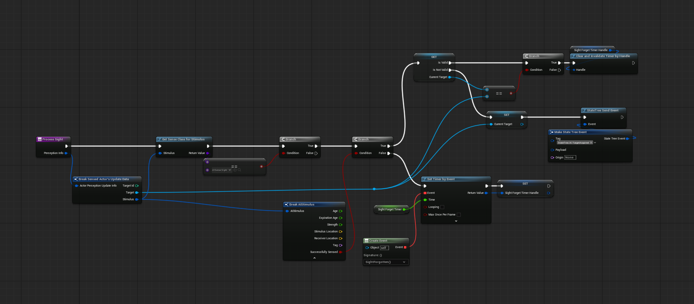

While building systems for my first commercial game, I had more problems than I care to admit building reliable AI in Unreal; even when what I wanted was a very simple and common behavior: patrol some path, go investigate when a noise is heard and chase when a target is acquired.

Individually, each of these states is easy enough to setup. The problem is switching between them at the right time in a way that is functional to the gameplay.

I believe partly it’s due to the **Unreal AI Perception system** being a bit cryptic and counterintuitive. And partly, because I didn’t fully understand the tools and was trying to create transitions the wrong way.

Eventually, I figured out a decent way to go about it. Let me share a few ideas here.

## What I Want to Build
As said, at its core, I want an agent that can switch between 3 states:

- **Default**: when the agent has no task. this can be used for example to patrol but also staying idle.
- **Investigate**: move to last heard location.
- **Chase**: follow player and/or attack.

The general idea is summed up in this graph:

It is basically composed of 2 parts: 
- the state machine handling the transitions 
- a task (which I called *UPDATE TASK* in the picture above), running alongside it, responsible to update all the variables that are required for the state machine transitions.

Let’s break it down.
---

## Transition Rules

Looking at the transitions we have:

- `DEFAULT → INVESTIGATE`: agent has no target, but we heard a sound.
- `INVESTIGATE → CHASE`: agent now has a valid target.
- `CHASE → INVESTIGATE`: agent lost the target for more than X seconds.
- `INVESTIGATE → DEFAULT`: Investigation completed without reacquiring the target.

All of them are based on **Perception** updates: either hearing or sight. So that is the main system we'll be dealing with. Unfortunately -and here comes the tricky part- we don't really get events from the Unreal Perception System as we would intuitively want them.

## AI Perception refresher

Since this system is likely one of the biggest hurdles for newcomers trying to build their simple AI, a little refresher is in order.

The system works by assigning an *AI Perception Component* to the agent's *AI Controller* and configuring which senses we want to be active.

The component offers a delegate that can be bound to receive informations every time a new target is perceived with one of the configured senses.

It offers a public, blueprint exposed, API with the following functions:

and the following delegates that can be bound to:

Now let's think of the logic we are trying to build. For the simple cases where we just need to know whether a target is in sight or a sound has been heard there's no major problems. But let's consider the CHASE->INVESTIGATE case. We want to be notified when the Agent has lost track of the target -when the sight sense has expired-. How would you go about that?

You might look at the senses config above and notice that it allows you to configure a `Max Age`: that is the amount of time a sense is kept into active memory before being discarded. Perfect! We can use this to forget the Sight sense after X seconds!

Wrong.

Or better, that is exactly what this setting does. But not as you might intuitively think. Let me elaborate.
There are -I believe- 2 ways you could think of going about it. And both have gotchas:

   1. Using the payload of the `OnPerceptionInfoUpdated` event
   2. Using the `OnTargetPerceptionForgotten` event 

### Why you will use OnPerceptionInfoUpdated wrong
This is the event with its payload:

You might look at it and think: since we get information on both the sense and the `Expiration Age`, we could check if this value is greater than or equal the `Max Age` (which you can configure in the `AIPercpetionComponent` - see pic above) et voilà! 

Wrong.

This is an *Update* event: it fires at the exact moment a stimulus information changes. That means when the target just got into sight, or just exited sight. If the event just happened, it means it had no time to tick its expiration clock yet: **the Expiration Age in PerceptionUpdate events callbacks will always be 0**!

Ok, but we can maybe use the `OnTargetPerceptionForgotten` then!

### Why you will use OnTargetPerceptionForgotten wrong
First of all, to use this event you need to explicitly enable it in Project Settings.

One you do this you can bind to the related event. The problem is that this event is fired only when **all** stimuli for a given Actor are forgotten. That is: if the agent forgets sight, but still has a hearing stimuli for the same actor, the event won't fire because technically the Agent is still aware of the target.

This is a problem for us: CHASE->INVESTIGATE requires that we detect when the Sight sense has expired, but not the Hearing one. On the contrary: we would like to fallback to existing hearing information for the same Actor so that we can tell the AI Agent to go investigate the last hearing stimulus.

So, how do we fix all this? 

I propose a timer.

## Handling sight stimulus

We basically create our own -sight-specific- aging system. It's very simple:

1. When sight is lost, we start a **timer**.
2. If the timer expires without reacquiring the target, we forget them.
3. If the target is seen again, we **reset the timer**.

How do we determine if sight is lost? Well, the info update comes with a *Is Successfully Sensed* boolean that we can use for this: if `True` the Agent just acquired line of sight (LOS), if `False` the LOS has just been lost.

The rest of the logic is very simple: register a new target when LOS is acquired -if the Agent didn't already have a valid target before- and reset the timer for the known target otherwise.

So the whole ordeal looks something like this, in Blueprint:

When the timer is up, we simply unset the tracked target:

### Handling hearing stimulus ###

This one can be kept simple: if we make the design decision to only investigate the last heard sound, then we can simply override the same variable evey time we get an update.
Every time a sound is heard, we store its location.

---

## Implementation
Now we have all the pieces and we just need to translate them into working code. If you want to go with UE's default AI systems you have 2 choices: Behavior Trees and State Trees.
I find it easier to model this using State Trees because they are built around the concept of, well, state.
You can achieve the same exact thing with Behavior Trees (after all, you can use BTs as State Machines) but that is the path you take if you really want to complicate your life. Because Behavior Trees are reactive it is harder to define when and how a transition should take place.
So how do we actually build this?
State Trees allow you to define authoritative transition logic: when this happens, go to this state.

The core of the system lives in a **State Tree Evaluator**, which does the following:

- Registers for **perception updates**
- Tracks the current **Target** and **LastHeardLocation**
- Sends **custom events** to trigger state transitions
- Starts and resets the **forget timer**

---

### Sight Stimulus Flow

Here’s how we handle sight updates:


1. If we *had a target* but lost it: start forget timer.
2. If we *didn’t have a target* and now we see one:
   - If it's the same as the one we just lost: stop the forget timer.
   - If it's new: send event, update the target.


---

### Hearing Stimulus Flow

Hearing is much simpler:

- We just update `LastHeardLocation` with each new sound.

---

## Showcase

Here’s what the final result looks like in Unreal:

---

## Final Thoughts

This setup isn’t complex, but clarity in transitions is key.

If you're struggling with Unreal’s Perception system — you’re not alone. But with a custom evaluator and a simple forget timer, you can build surprisingly flexible AI logic.


I’m planning to do a follow-up on adding **attack and retreat** logic next. If you’re interested, follow me on [YouTube](https://youtube.com/) or [Twitter](https://twitter.com/).
