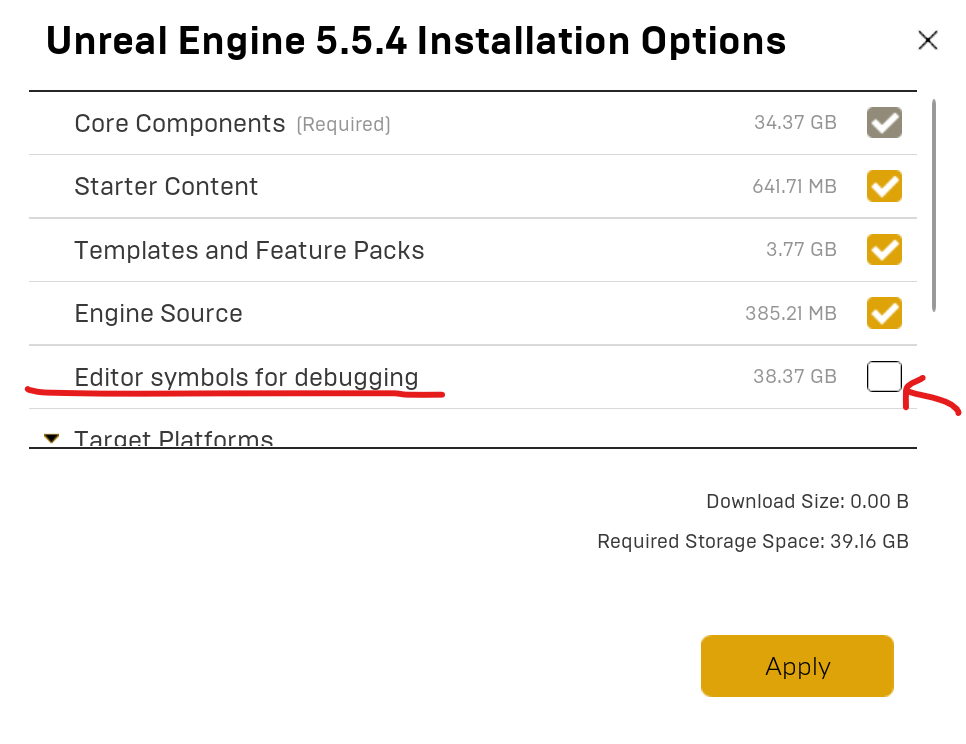
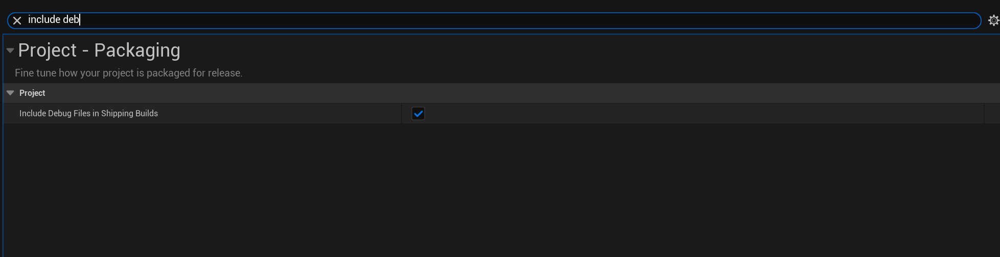
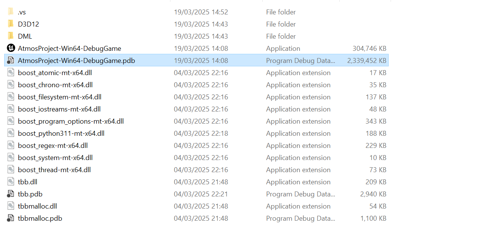
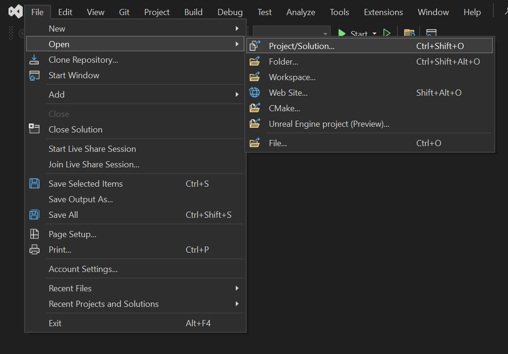
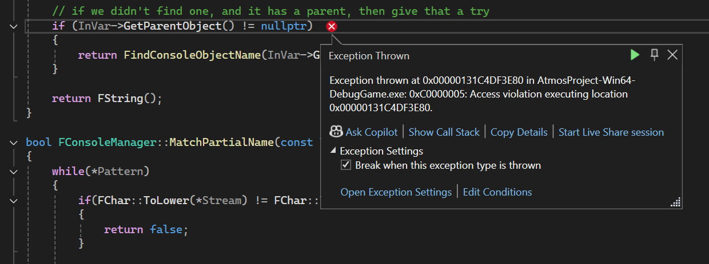

# Context
Recently I had to deal with a very nasty error happening on a packaged build of my upcoming game (The Last Toast - working title).

The game would exit without a useful error message, and looking at the logs, I could not find anything helpful—just a vague stack trace hinting at the issue being inside the Render Thread. Sure, but where? Why? What is the issue exactly?

I figured this could be a problem for someone else as well, so here is a small guide on how to deal with such a problem.

The goal is to be able to enter a breakpoint at the exact C++ line that is failing.

## How to debug an Engine crash on a packaged build in Unreal
I want to emphasize that this guide is intended to debug an issue that comes from Engine code. If your game is crashing on game code, you likely won't need to check things down at the engine level.

In order to breakpoint engine code on a running build, there are fundamentally two options:
1. Use debug symbols.
2. Use a version of the engine compiled from source. 

The first option is definitely easier but may not include symbols for your specific issue. I think it's still worth trying it first before resorting to building the whole engine.

To enable the debug symbols, you simply need to go into the Epic Games Launcher and enable the following option (little arrow next to "Launch" -> Options).

Then you need to ensure you are packaging the game using the "Debug" configuration. Why Debug? Because this builds both engine and game code without optimizations; code is not altered, and memory layout is not changed.

You can select the build configuration from inside the editor from the Package menu.

I recommend checking out the [documentation about this](https://dev.epicgames.com/documentation/en-us/unreal-engine/build-configurations-reference-for-unreal-engine) on the official website and/or watching [this video](https://dev.epicgames.com/community/learning/tutorials/dXl5/advanced-debugging-in-unreal-engine#intro).

According to the docs, the output build folder should include the .pdb files if built with any configuration that is not Shipping. However, in my case, the file was not generated until I enabled the relevant option in project settings by going to: Project Settings → Project → Packaging → Project → Include Debug Files in Shipping Builds. Really not sure why that is.

You can easily check if your setup included the symbols file by going into your built game directory → _Project Name_ → Win64 → Binaries and checking that you have the aforementioned .pdb file next to the executable. 


I am not sure what the folder structure and debug symbols are on Linux and macOS. Guess it's not going to be that different anyway.


Once you have this step set up, you are ready for the actual debugging. Launch Visual Studio and open a new solution. But instead of looking for a .sln file, you can now navigate to the _.exe_ inside the Binaries folder (not the one at the root!) and start it as you would for a regular configuration.

Your game should launch. Now just trigger the crash and, lo and behold, you should see Visual Studio taking over with an automatic exception breakpoint right where the issue was triggered. You might even be able to inspect memory at that point.

In my case, I could see that the issue was related to the Cheat Manager loading some unreferenced CVar (I had set up some test CVar in the Project Setting some time ago and then totally forgot about it). I removed that, and all was fine.

I doubt I would have ever figured this out without going through this debugging process. I hope this helps some other folks out there!
