I always wanted to create a procedural creature of some sort. During development of One Last Toast I didn't really have the time and budget to do so. But with the game released I gave it a go.  
Here's the results:

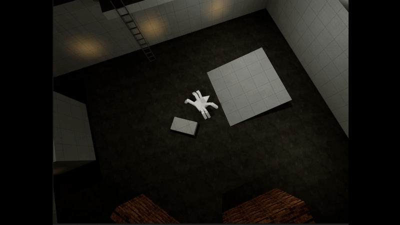

How did I make it? I'll walk you through it so you can reproduce it for yourself.

## The Model
I started by modeling this beauty in Blender.

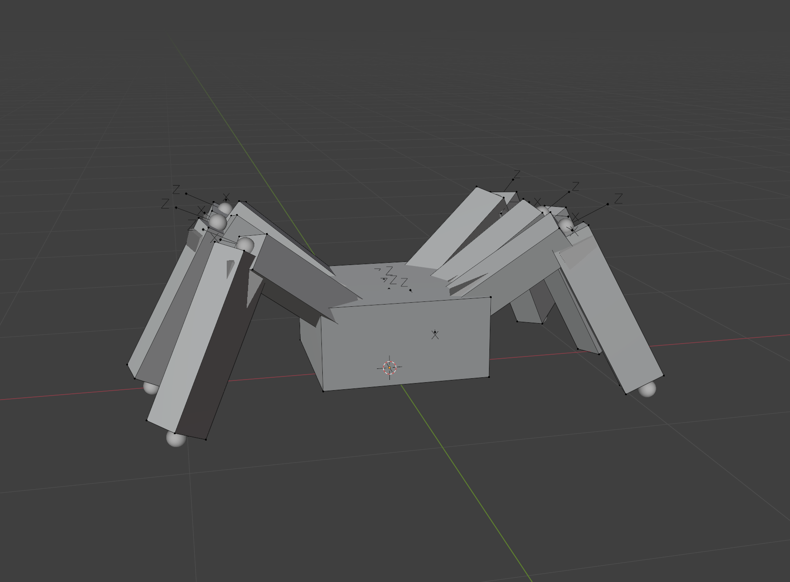

I know, I should have gone to art school.  
What matters here is not really the art but the bone orientation.

You need to ensure that bones have a consistent orientation (for example Z always facing up and Y facing along the bone).  
I went for a simple approach: 3 bones for each leg (2 for the joints and 1 for the foot) and 1 bone for the body/root.

The feet are not skinned, they are just used as controls for the IK leg system that we will build in Control Rig.

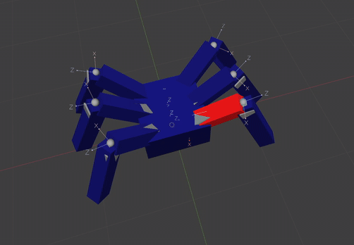

When that's ready, we can export and move to Unreal.

PS: I will occasionally call this monster a "spider" even if it has only 6 legs. Let's all agree to that for simplicity.


By default, importing from Blender to Unreal often causes the armature scaling to be messed up. You end up with bones that are 100 times smaller in Unreal, which makes the whole mesh tiny and causes animation issues.

Before export in Blender:
- Select armature and mesh
- Scale both by 100
- Apply scale
- Scale mesh by 0.10 and leave it as is


## How A Procedural Walk Works
The core idea is to keep the legs fixed in place and only move them when the body has moved far enough to justify a replant.

When a replant happens, the leg moves back to its **Home Location**. This is the ideal target position that restores the natural offset from the body.  
If you modeled your spider in a neutral resting pose, you can store each leg's initial offset for this purpose.

The Home Location must move and rotate with the body, so it is defined in **World Space**.

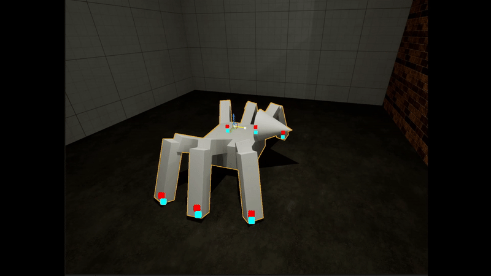

The Home Location is visualized in red in this gif.


Understanding the difference is quite important. 

**Local Space** means positions are relative to the rig origin (skeletal mesh location). No matter where the mesh moves in the world, that point will always be (0,0,0) in Local Space.  

**World Space** means the actual world position in the level.  
We store offsets in Local Space but calculate Home Locations in World Space.

I encourage you to use the Draw Box debug node to visualize where points appear when a mesh is positioned in the world while switching between World and Local space with the `ToWorld` and `FromWorld` nodes.


After showing you how to set this up concretely, we will build on this idea by also adding:
- obstacle collision detection for each leg
- a nice arched interpolation when stepping
- a tripod stepping pattern for a natural gait

## Setup in Unreal
In Unreal, create a `Control Rig` from the spider mesh.

In the Setup function -which runs once at construction time- let's spawn controls to act as the IK effectors.  
This is also the time to store the **Initial Leg Offsets** (Local Space) in one array, and the **Current World Space Locations** of the legs in another. These WS locations are what we will move to control the legs.

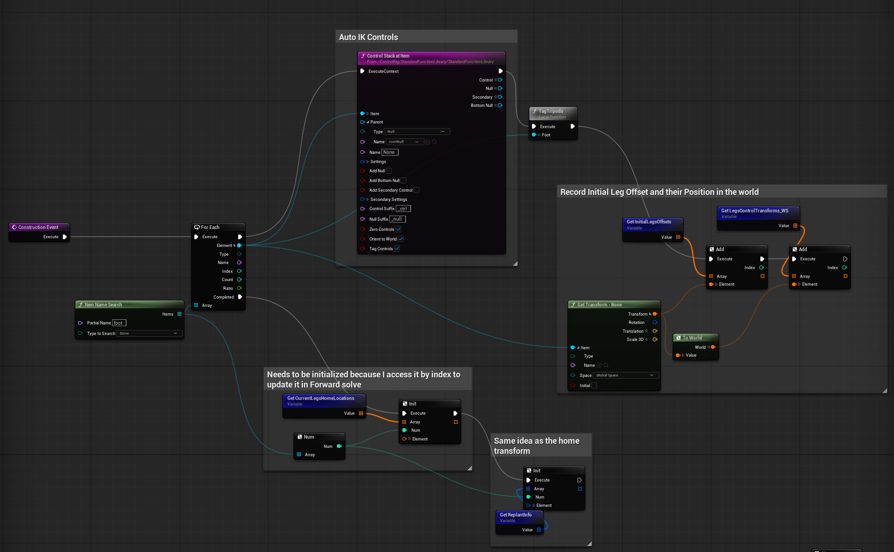

Ignore *Tag Tripod* and *Replant Info* for now. We will come back to them later.


Keep index consistency.  
As you will see we will use a series of arrays to setup this rig. If index `i` in one array refers to a leg, the same index in any other array must refer to that exact same leg.  
This is actually quite simple to achieve: on setup we construct a few arrays iterating over each leg. As long as we keep using these indexes for any other array we will need, all will be fine.


## Calculating Home Locations
The intuition is simple: we take the current **Initial Leg Offsets** (which are in Local Space) and add the body locations to them. Basically we are creating an imaginary point for each leg, which is relative to the body location and that we can use as a target for the replant.

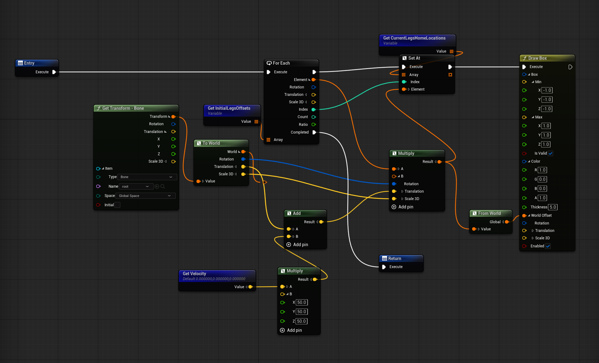

This is done with a *Transform * Transform* operation between the root and each leg. This operation applies one transform’s rotation and location to another, essentially moving the offset into world space.


Notice how I do a *To World* on the root before multiplying the transforms. This way the result will be a World Location. That's important because subsequent calculations will be based on this.



In my version I also account for velocity (which I feed into the rig from the Animation BP) to handle sudden direction changes from AI movement. This is optional and frankly should be done better than just using an arbitrary magnitude of "50". So please ignore that :)


## Step Condition and Replant Trigger
With both the current Leg Worls Space Locations and the Home Location calculated, the step trigger is simple:
If the distance between the two is greater than a threshold, start a replant.

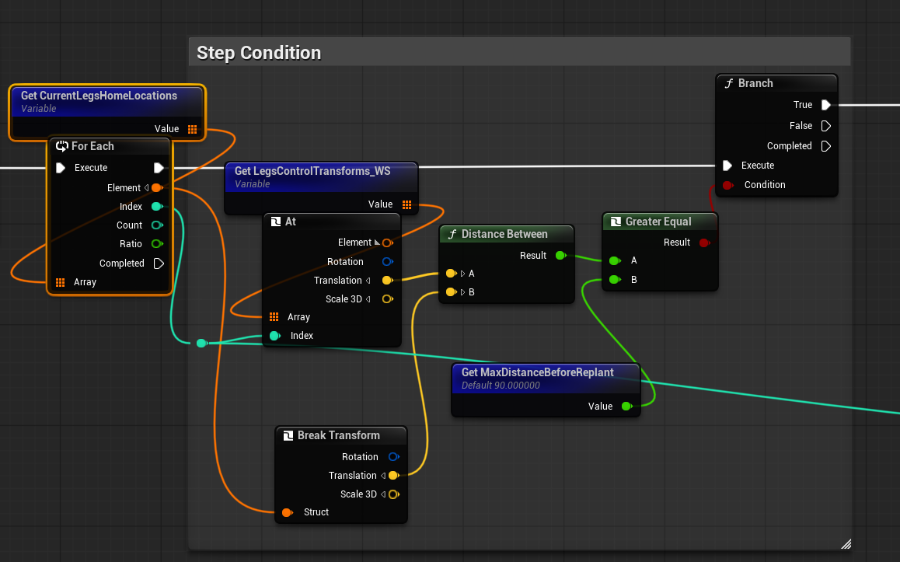

I store replant data in a struct array containing the start location and destination (both in World Space). This makes the graph cleaner.  
We first decide which legs need replanting, then run a separate function to handle the interpolation.

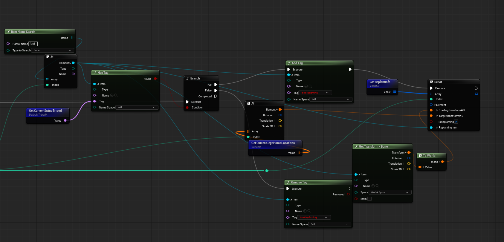

## Arched Step Interpolation
So now we have a struct containing info about the legs that need replanting. In the next step we iterate through them and applying the actual replant logic.

When a replant is triggered, we do not instantly snap the leg to the Home Location.  
Instead, we interpolate from the current position to the Home Location, adding an arched Z movement for realism.

During interpolation, X and Y use a standard Interpolate node, while Z uses a curve remapped so that the maximum value is the apex of the arch.

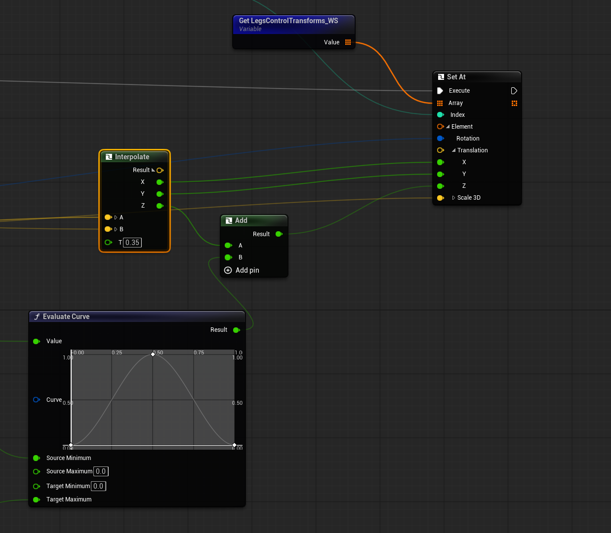

When the distance between the current location and the Home Location is nearly zero, the replant is considered complete.

## Tripod Stepping
At this point, all legs trigger a replant at about the same time if the "spider" is moving in a straight line. This results in a very unnatural motion. Insects (and any other animal with more than a few legs) tend to move in a gaited pattern. It's a [whole world you can get lost into](https://hexapodrobots.weebly.com/insect-walking-mechanisms.html) but the gist of it is that legs move in groups to guarantee maximum stability: when one group moves, the other stays planted.

For a 6 legged creature we will group them into two tripods:

Tripod 1:
- front right leg
- back right leg
- central left leg

Tripod 2:
- front left leg
- back left leg
- central right leg

Remember in the Setup function there was a Tag Tripods function? That is where we assign each leg to a tripod. 
A variable called Current Swing Tripod tracks which tripod is currently allowed to replant. When a replant finishes, we will switch to the other tripod.

So, in Setup, assign each leg to a tripod.

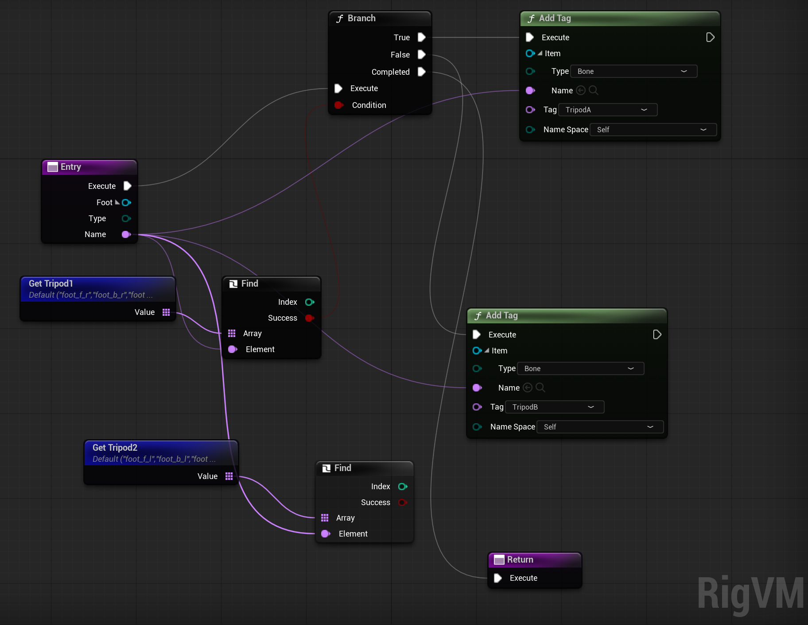

A variable called *Current Swing Tripod* tracks which tripod is currently allowed to replant.  
When a replant finishes, switch to the other tripod.

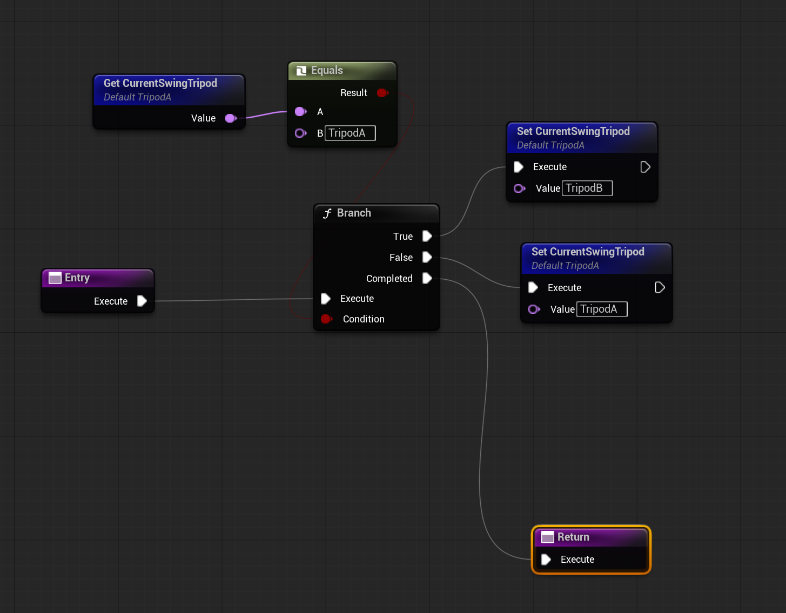

At the end of a step (which for us is when the interpolation of a replant ends), we will switch tripod and remove the leg from the array of legs that needs a replant:

## Applying IK
The last step is to setup the IK for the legs.
This is very simple, the only care is to use the world space target positions we calculated earlier as the Effector Transform for the IK. This way we will effectively use our calculations to determine the end location of each foot.

If you are using 2 leg bones per leg, a `BASIC IK` node will work. Otherwise, use `FABRIK` for a 3+ bone setup.  
Use the **Current World Space Location** array as the Effector Transform for each leg. Notice that I am actually converting the World Space transforms to local space because that is what the solver expects.

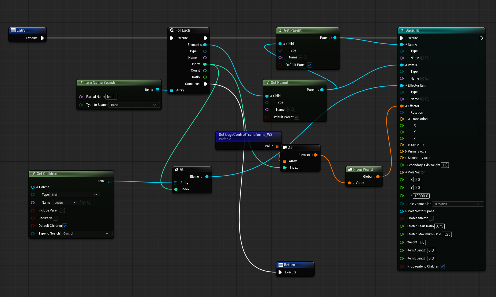

IK should be the final step in the solver. To keep things tidy, run it after all logic using a Sequence node.

## Obstacle Detection
Finally, to handle uneven terrain, cast a ray straight down from above each leg location. If a hit is found, adjust the vertical position accordingly before IK.

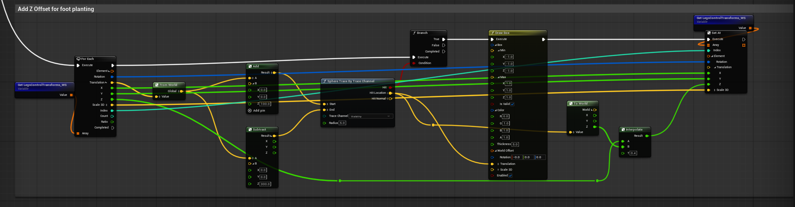

You can interpolate this adjustment for smoother results.

---

The amount of improvements you can add to this are endless but what we built up to here should already give you a solid base to start off of.
If you run into any issue with this you are welcome to let me know in a comment, I will try to help out where possible!