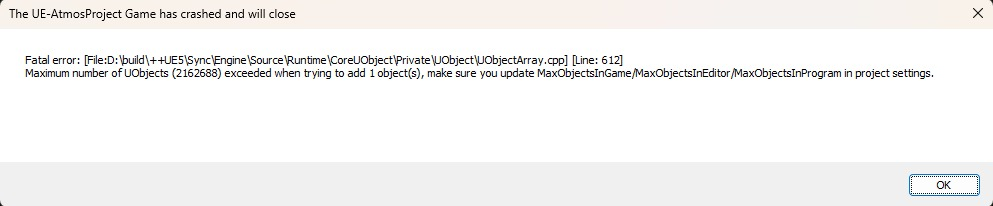
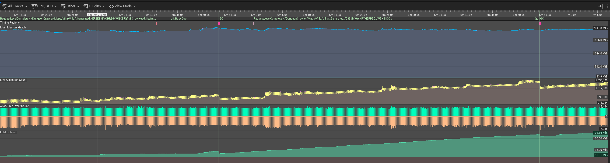
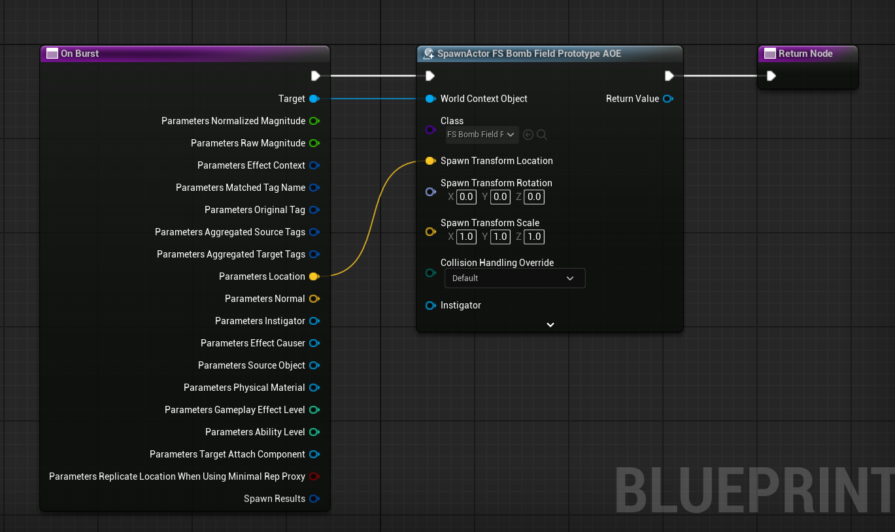
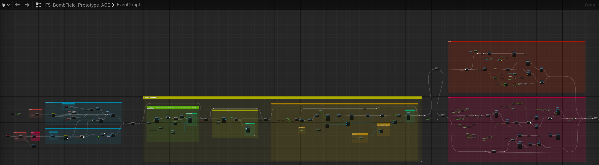
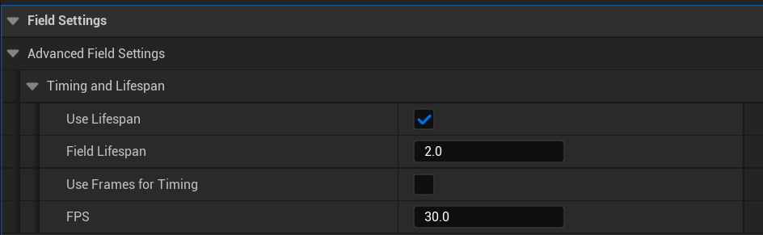

I have recently opened up my upcoming game (["One Last Toast"](https://store.steampowered.com/app/3639210/One_Last_Toast/)) for a closed beta test among friends.

Among a plethora of other bugs they reported, one stood more ominous than the rest:



The reports had this happen midway through a playthrough.

At a quick glance the issue is clear: too many UObjects (Unreal's own object base class) are being spawned in the game, they are piling up and, when they reach a safeguard limit, the engine shuts down to prevent the leak from eating up more resources.

Great.

Now, who is the culprit?

That is the harder question. Profiling tools to the rescue!

## Profiling for object leaks

The first thing I did was starting UnrealInsights.exe with relevant arguments to display memory and uobject-related data (`memory,object`).

I targeted the same build my friends were playtesting and... I started playing the game. In order to focus on the specific problem at hand I used the handy LLM tags to display only UObject allocations and deallocations events.

After about 6 minutes of playing, I started seeing some clear and steady increase in the allocation count:



You can see in the graph that the number of allocated objects keeps increasing and the Garbage Collector just can't keep up the pace.

That is a good start. The next challenge is trying to figure out what could be causing the issue. I didn't immediately realised that something suspicious was going on but luckily the profiler has this concept of "Bookmarks" which are label given to specific events. Some of them are automatically assiged, like in the case of a Level Sequence playing or the Garbage Collector cleaning up some stale objects.


This helped me noticing that the issue started appearing soon after the LS_Ruby sequencer played. LS_Ruby is the little cinematic playing when the player inserts the Ruby Key in the related panel as a mean to progress in the game's mansion.

That gave me a significant hint as to where the problem was starting from.

With this in mind, I decided to narrow down my guess even further. I fired up the editor with the same trace profile:

```start "" "C:\Program Files\Epic Games\UE_5.X\Engine\Binaries\Win64\UnrealEditor.exe" OneLastToast.uproject -trace=default,memory,object,loadtime -statnamedevents
```

and positioned myself straight in front of the Ruby Door.
What happened after entering is the following:


Look at the LLM UObject allocation graph at the bottom: sure enough something is going on with this explosion. I left the insights running and confirmed that this was not a temporary thing: the graph kept going up steadily after this event.

I started looking for spawning logic related to the explosion and:



A likely culprit appeared.

FS Bomb Field is an actor that i subclassed directly from an Engine example which is in charge of applying all the physics effects related to the explosion.

On its own the spawning logic I have in my Blueprint is not enough to justify a memory leak but this behemot of a Bomb Field actor is doing so much and somewhere, in the logic managing the collision of the field with other actors, it is causing wild object spawning. 

I am actually not sure where and why this happens. The Bombfield logic is quite... intense...



And this is not even all the graph. I tried to look for spawning inducing logic in this madness but could not really find it.

What I do know is:

- There is a clear memory leak
- The leak start to happen right after the enemy explodes (I tried the same enemy exploding on an empty map and the same pattern appeared)
- The bombfield is a big Blueprint with lots of collision spheres and logic

This was enough to prompt me to ensure the field is cleaned up after the explosion to see if removing it from the world, alongside all its logic ad its cumbersome footprint, would help. I did set a lifetime for it here:



So that after 2 seconds (enough for the explosion forces to push nearby bodies away) the actor is destroyed and look at that:


No more sudden increase of UObject allocation after the explosion! I let the thing run for a while just to be sure but all seems good now.

Will this fix the original crash definitively? I hope! But I can't really guarantee that there aren't other possible causes yet. 

But for sure this was a very nasty leak that is now patched for good.

I'll be sure to update the post should I gain more insights on why the bomb field is causing uncontrolled UObject spawning and if this fix was enough to guarantee a crash free experience for the testers.

For now, I am quite happy with what I managed to do on my first proper use of Unreal Isights and hope this little adventure could be helpful for anyone dealing with apparently hard-to-pinpoint bugs.